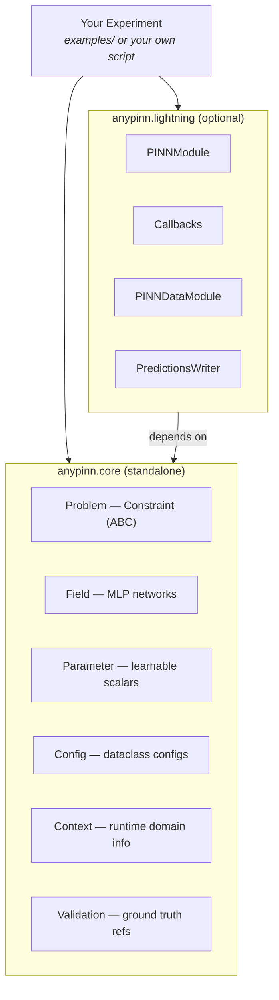
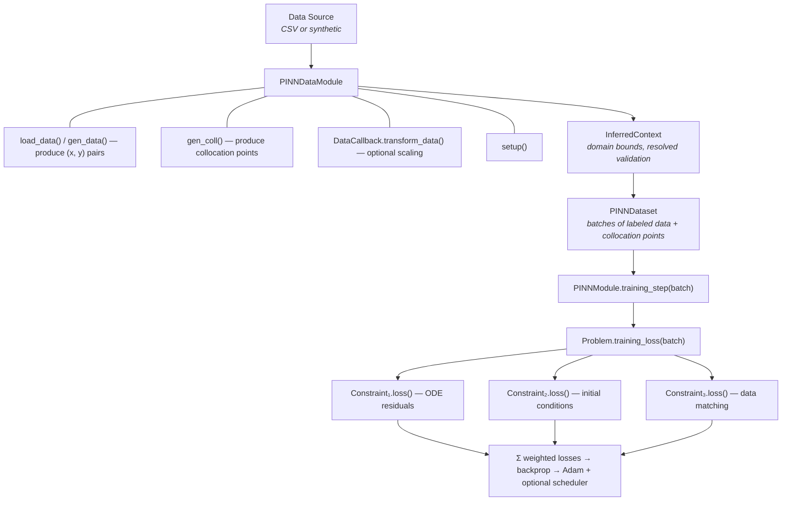
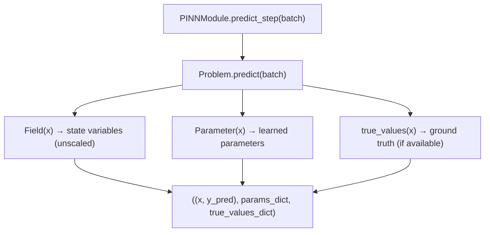

# AnyPINN

[![GitHub Actions][github-actions-badge]](https://github.com/johnthagen/python-blueprint/actions)
[![uv][uv-badge]](https://github.com/astral-sh/uv)
[![Ruff][ruff-badge]](https://github.com/astral-sh/ruff)
[![Type checked with ty][ty-badge]](https://docs.astral.sh/ty/)

[github-actions-badge]: https://github.com/johnthagen/python-blueprint/actions/workflows/ci.yml/badge.svg
[uv-badge]: https://img.shields.io/endpoint?url=https://raw.githubusercontent.com/astral-sh/uv/main/assets/badge/v0.json
[ruff-badge]: https://img.shields.io/endpoint?url=https://raw.githubusercontent.com/astral-sh/ruff/main/assets/badge/v2.json
[ty-badge]: https://img.shields.io/badge/ty-typed-blue

A modular, extensible Python library for solving differential equations using Physics-Informed Neural Networks (PINNs). Built for scalability — from one-click experiments to fully custom problem definitions.

## Philosophy

AnyPINN is designed around two principles:

1. **Separation of concerns.** The mathematical problem definition is completely decoupled from the training engine. You can use one without the other.
2. **Progressive complexity.** Start simple, go deep only when you need to.

This means the library serves three types of users:

| User                  | Goal                                               | How                                                                    |
| --------------------- | -------------------------------------------------- | ---------------------------------------------------------------------- |
| **Experimenter**      | Run a known problem, tweak parameters, see results | Pick a built-in problem, change config, press start                    |
| **Researcher**        | Define a new problem with custom physics           | Implement `Constraint` and `Problem`, use the provided training engine |
| **Framework builder** | Custom training loops, novel architectures         | Use the core abstractions directly, skip Lightning entirely            |

## Architecture

The library is split into two independent layers:



### Core (`anypinn.core`) — The Math Layer

The core is a pure PyTorch library. It defines what a PINN problem _is_, with no opinions about how you train it.

- **`Problem`** — Aggregates constraints, fields, and parameters. Provides `training_loss()` and `predict()`.
- **`Constraint`** (abstract) — A single loss term. Subclass it to define any physics equation, boundary condition, or data-matching loss.
- **`Field`** — An MLP that maps input coordinates to state variables (e.g., `t -> [S, I, R]`).
- **`Parameter`** — A learnable scalar or function-valued parameter (e.g., `beta` in an SIR model).
- **`InferredContext`** — Runtime information (domain bounds, validation data) extracted from training data and injected into constraints.

You can use `Problem.training_loss()` inside any training loop — plain PyTorch, Hugging Face Accelerate, or anything else.

### Lightning (`anypinn.lightning`) — The Training Engine (Optional)

A thin wrapper that plugs a `Problem` into PyTorch Lightning. Use it when you want batteries-included training with minimal boilerplate:

- **`PINNModule`** — Wraps a `Problem` as a `LightningModule`. Handles optimizer setup, context injection, and prediction.
- **`PINNDataModule`** — Abstract data module that manages data loading, collocation point generation, and context creation.
- **`Callbacks`** — SMMA-based early stopping, formatted progress bars, prediction writers, data scaling.

### Problems (`anypinn.problems`) — Ready-Made Templates

Pre-built constraint sets for common problem types:

- **ODE layer** (`ode.py`): `ResidualsConstraint`, `ICConstraint`, `DataConstraint` — covers most ODE inverse problems out of the box.
- **SIR Inverse** (`sir_inverse.py`): Full and reduced SIR model implementations.

## Data Flow

### Training



### Prediction



## Getting Started

### Installation

```bash
uv sync
```

### Run an Example

```bash
cd examples/sir_inverse
python sir_inverse.py
```

### Implement a New Problem

1. **Define your ODE** as a callable matching the `ODECallable` protocol:

```python
def my_ode(x: Tensor, y: Tensor, args: ArgsRegistry) -> Tensor:
    # Return dy/dx
    ...
```

2. **Configure hyperparameters**:

```python
@dataclass(frozen=True, kw_only=True)
class MyHyperparameters(PINNHyperparameters):
    pde_weight: float = 1.0
    data_weight: float = 1.0
```

3. **Build the problem** from constraints:

```python
problem = MyProblem(
    constraints=[
        ResidualsConstraint(field, ode_props, weight=hp.pde_weight),
        DataConstraint(predict_fn, weight=hp.data_weight),
    ],
    fields={"u": field},
    params={"k": param},
)
```

4. **Train** with Lightning or your own loop:

```python
# With Lightning
module = PINNModule(problem, hp)
trainer = pl.Trainer(max_epochs=50000)
trainer.fit(module, datamodule=dm)

# Or plain PyTorch
for batch in dataloader:
    loss = problem.training_loss(batch, log=my_log_fn)
    loss.backward()
    optimizer.step()
```

See `examples/` for complete implementations:

- `sir_inverse/` — SIR epidemic model (full, reduced, hospitalized variants)
- `damped_oscillator/` — Damped harmonic oscillator
- `lotka_volterra/` — Predator-prey dynamics
- `seir_inverse/` — SEIR epidemic model

## Bootstrap CLI (`anypinn create`)

A scaffolding tool inspired by `create-next-app` that bootstraps a new PINN project interactively.

```bash
anypinn create my-project
```

The CLI walks you through three choices and generates a complete, runnable project:

```
$ anypinn create my-project

? Choose a starting point:
  > SIR Epidemic Model
    SEIR Epidemic Model
    Damped Oscillator
    Lotka-Volterra
    Custom ODE
    Blank project

? Select training data source:
  > Generate synthetic data
    Load from CSV

? Include Lightning training wrapper? (Y/n)

Creating my-project/...
  pyproject.toml   — project dependencies
  ode.py           — mathematical definition
  config.py        — training configuration
  train.py         — execution script
  data/            — data directory

Done! cd my-project && uv sync && uv run train.py
```

### Options

All prompts can also be passed as flags to skip the interactive flow:

| Flag | Values | Description |
|------|--------|-------------|
| `--template, -t` | `sir`, `seir`, `damped-oscillator`, `lotka-volterra`, `custom`, `blank` | Starting template |
| `--data, -d` | `synthetic`, `csv` | Training data source |
| `--lightning / --no-lightning` | — | Include PyTorch Lightning wrapper |

### Generated Project

The scaffolded project reflects your choices:

- **`pyproject.toml`** — Dependencies, conditionally including `lightning` and `torchdiffeq`
- **`ode.py`** — ODE function matching the `ODECallable` protocol
- **`config.py`** — Hyperparameters with sensible defaults for your data source
- **`train.py`** — Full training script (Lightning `Trainer` or a plain PyTorch loop, depending on your choice)
- **`data/`** — Data directory (pre-populated with CSV placeholders when relevant)

## Development

### Tooling

| Tool                                       | Purpose                |
| ------------------------------------------ | ---------------------- |
| [uv](https://github.com/astral-sh/uv)     | Dependency management  |
| [just](https://github.com/casey/just)      | Task automation        |
| [Ruff](https://github.com/astral-sh/ruff) | Linting and formatting |
| [pytest](https://docs.pytest.org/)         | Testing                |
| [ty](https://docs.astral.sh/ty/)           | Type checking          |

### Commands

```bash
just test           # Run tests with coverage
just lint           # Check code style
just fmt            # Format code (isort + ruff)
just lint-fix       # Auto-fix linting issues
just check          # ty type checking
just docs           # Build documentation
just docs-serve     # Serve docs locally
just ci             # Run lint + check + test
```

## Contributing

When contributing:

- Follow the existing code style (Ruff, line length 99, absolute imports only)
- Keep the two-layer separation: core stays pure PyTorch, Lightning stays optional
- If you change the architecture or data flow, update both `CLAUDE.md` and this README to reflect the changes
