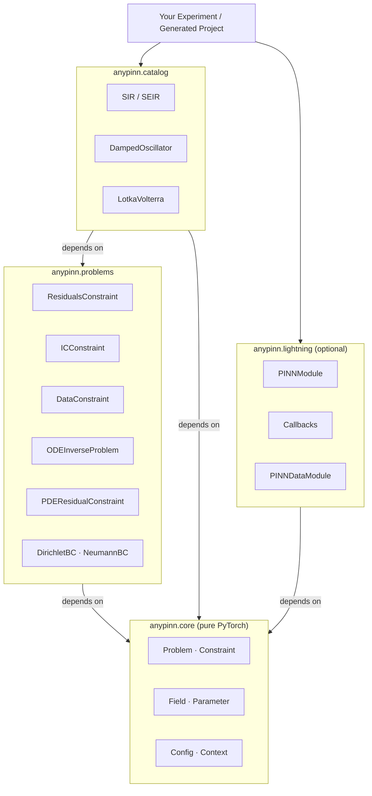

<p align="center">
  
</p>

<h1 align="center">AnyPINN</h1>

<p align="center">
  <strong>Solve differential equations with Physics-Informed Neural Networks.</strong><br>
  <sub>Modular. Training-agnostic. Inverse-problem-first.</sub>
</p>

<p align="center">
  <a href="https://joss.theoj.org/papers/2a267aab98e21b7773af0952553b1cec"></a>
  <a href="https://pypi.org/project/anypinn/"></a>
  <a href="https://github.com/giacomoguidotto/anypinn/actions"></a>
  <a href="https://github.com/astral-sh/uv"></a>
  <a href="https://github.com/astral-sh/ruff"></a>
  <a href="https://docs.astral.sh/ty/"></a>
</p>

<br>

Most PINN libraries make you wire up every loss term, collocation grid, and training loop by hand before you see a single result. AnyPINN gives you a working experiment in one command and then lets you peel back every layer when you're ready.

<p align="center">
  <video src="https://raw.githubusercontent.com/giacomoguidotto/anypinn/main/assets/demo.mp4" controls width="600"></video>
</p>

<p align="center">
  
  <br><br>
  
  <br><br>
  
</p>

## 🚀 Quick Start

The fastest way to start is from the terminal. The command below generates a complete, runnable project interactively, no manual setup needed. [uvx](https://docs.astral.sh/uv/guides/tools/) lets you run it without installing anything permanently:

```bash
uvx anypinn create my-project
```

[pipx](https://pipx.pypa.io/stable/installation/) works the same way:

```bash
pipx run anypinn create my-project
```

Run `anypinn create --help` to see all available flags and templates. For a full walkthrough covering project structure, configuration, training, and next steps, see the [Getting Started](https://anypinn.guidotto.dev/getting-started/) guide.

## 👥 Who Is This For?

AnyPINN is built around **progressive complexity**. Start simple, go deeper only when you need to.

| User                  | Goal                                               | How                                                                   |
| --------------------- | -------------------------------------------------- | --------------------------------------------------------------------- |
| **Experimenter**      | Run a known problem, tweak parameters, see results | Pick a built-in template, change config, press start                  |
| **Researcher**        | Define new physics or custom constraints           | Subclass `Constraint` and `Problem`, use the provided training engine |
| **Framework builder** | Custom training loops, novel architectures         | Use `anypinn.core` directly, no Lightning required                    |

## 💡 Examples

The `examples/` directory has ready-made, self-contained scripts covering epidemic models, oscillators, predator-prey dynamics, and more, from a minimal ~80-line core-only script to full Lightning stacks. They're a great source of inspiration when defining your own problem.

## 🔬 Defining Your Own Problem

If you want to go beyond the built-in templates, here is the full workflow for defining a custom inverse problem. The example below uses an ODE; PDEs follow the same pattern with different building blocks (`PDEResidualConstraint`, `DirichletBCConstraint`, etc.).

### 1: Define the equation

Write a function that returns derivatives given the current state and parameters:

```python
from torch import Tensor
from anypinn.core import ArgsRegistry

def my_ode(x: Tensor, y: Tensor, args: ArgsRegistry) -> Tensor:
    k = args["k"](x)        # learnable or fixed parameter
    return -k * y           # simple exponential decay
```

### 2: Configure hyperparameters

```python
from dataclasses import dataclass
from anypinn.problems import ODEHyperparameters

@dataclass(frozen=True, kw_only=True)
class MyHyperparameters(ODEHyperparameters):
    pde_weight: float = 1.0
    ic_weight: float = 10.0
    data_weight: float = 5.0
```

### 3: Build the problem

```python
from anypinn.problems import ODEInverseProblem, ODEProperties

props = ODEProperties(ode=my_ode, args={"k": param}, y0=y0)
problem = ODEInverseProblem(
    ode_props=props,
    fields={"u": field},
    params={"k": param},
    hp=hp,
)
```

### 4: Train

```python
import pytorch_lightning as pl
from anypinn.lightning import PINNModule

# With Lightning (batteries included)
module = PINNModule(problem, hp)
trainer = pl.Trainer(max_epochs=50_000)
trainer.fit(module, datamodule=dm)

# Or with your own training loop (core only, no Lightning)
optimizer = torch.optim.Adam(problem.parameters(), lr=1e-3)
for batch in dataloader:
    optimizer.zero_grad()
    loss = problem.training_loss(batch, log=my_log_fn)
    loss.backward()
    optimizer.step()
```

For complete walkthroughs, see the [custom ODE guide](https://anypinn.guidotto.dev/latest/guides/custom/) and the [PDE forward problems guide](https://anypinn.guidotto.dev/latest/guides/pde-forward-problems/).

## 🏗️ Architecture

Four layers with a strict dependency direction: outer layers depend on inner ones, never the reverse.


```mermaid
graph TD
    EXP["Your Experiment / Generated Project"]

    EXP --> CAT
    EXP --> LIT

    subgraph CAT["anypinn.catalog"]
        direction LR
        CA1[SIR / SEIR]
        CA2[DampedOscillator]
        CA3[LotkaVolterra]
    end

    subgraph LIT["anypinn.lightning (optional)"]
        direction LR
        L1[PINNModule]
        L2[Callbacks]
        L3[PINNDataModule]
    end

    subgraph PROB["anypinn.problems"]
        direction LR
        P1[ResidualsConstraint]
        P2[ICConstraint]
        P3[DataConstraint]
        P4[ODEInverseProblem]
        P5[PDEResidualConstraint]
        P6[DirichletBC · NeumannBC]
    end

    subgraph CORE["anypinn.core (pure PyTorch)"]
        direction LR
        C1[Problem · Constraint]
        C2[Field · Parameter]
        C3[Config · Context]
    end

    CAT -->|depends on| PROB
    CAT -->|depends on| CORE
    LIT -->|depends on| CORE
    PROB -->|depends on| CORE
```

For a detailed breakdown of each layer, see the [Architecture guide](https://anypinn.guidotto.dev/latest/guides/architecture/).

## 🤝 Contributing

See [CONTRIBUTING.md](CONTRIBUTING.md) for setup instructions, code style guidelines, and the pull request workflow.
