# AnyPINN

[![CI][github-actions-badge]](https://github.com/johnthagen/python-blueprint/actions)
[![uv][uv-badge]](https://github.com/astral-sh/uv)
[![Ruff][ruff-badge]](https://github.com/astral-sh/ruff)
[![Type checked with ty][ty-badge]](https://docs.astral.sh/ty/)

[github-actions-badge]: https://github.com/johnthagen/python-blueprint/actions/workflows/ci.yml/badge.svg
[uv-badge]: https://img.shields.io/endpoint?url=https://raw.githubusercontent.com/astral-sh/uv/main/assets/badge/v0.json
[ruff-badge]: https://img.shields.io/endpoint?url=https://raw.githubusercontent.com/astral-sh/ruff/main/assets/badge/v2.json
[ty-badge]: https://img.shields.io/badge/ty-typed-blue

> **Work in Progress** — This project is under active development and APIs may change. If you run into any issues, please [open an issue on GitHub](https://github.com/giacomopiccinini/anypinn/issues).

**A modular Python library for solving differential equations with Physics-Informed Neural Networks.**

AnyPINN lets you go from zero to a running PINN experiment in seconds, or give you the full control to define custom physics, constraints, and training loops. You decide how deep to go.

## 🚀 Quick Start

The fastest way to start is the bootstrap CLI. It scaffolds a complete, runnable project interactively. Run it with [uvx](https://docs.astral.sh/uv/guides/tools/) (ships with `uv`):

```bash
uvx anypinn create my-project
```

or with [pipx](https://pipx.pypa.io/stable/installation/):

```bash
pipx run anypinn create my-project
```

```
? Choose a starting point:
  > SIR Epidemic Model
    ...
    Custom ODE
    Blank project

? Select training data source:
  > Generate synthetic data
    Load from CSV

? Include Lightning training wrapper? (Y/n)

Creating my-project/
  ✓  pyproject.toml   project metadata & dependencies
  ✓  ode.py           your ODE definition
  ✓  config.py        hyperparameters with sensible defaults
  ✓  train.py         ready-to-run training script
  ✓  data/            data directory

  Done! Run:  cd my-project && uv sync && uv run train.py
```

All prompts are also available as flags to skip the interactive flow:

```bash
anypinn create my-project \
  --template sir \
  --data synthetic \
  --lightning
```

| Flag                    | Values                                       | Description                                    |
| ----------------------- | -------------------------------------------- | ---------------------------------------------- |
| `--help, -h`            | —                                            | Show help and exit                             |
| `--list-templates, -l`  | —                                            | Print all templates with descriptions and exit |
| `--template, -t`        | built-in template name, `custom`, or `blank` | Starting template                              |
| `--data, -d`            | `synthetic`, `csv`                           | Training data source                           |
| `--lightning, -L`       | —                                            | Include PyTorch Lightning wrapper              |
| `--no-lightning, -NL`   | —                                            | Exclude PyTorch Lightning wrapper              |

## 👥 Who Is This For?

AnyPINN is built around **progressive complexity**. Start simple, go deeper only when you need to.

| User                  | Goal                                               | How                                                                   |
| --------------------- | -------------------------------------------------- | --------------------------------------------------------------------- |
| **Experimenter**      | Run a known problem, tweak parameters, see results | Pick a built-in template, change config, press start                  |
| **Researcher**        | Define new physics or custom constraints           | Subclass `Constraint` and `Problem`, use the provided training engine |
| **Framework builder** | Custom training loops, novel architectures         | Use `anypinn.core` directly — zero Lightning required                 |

## 💡 Examples

The `examples/` directory has ready-made, self-contained scripts covering epidemic models, oscillators, predator-prey dynamics, and more — from a minimal ~80-line core-only script to full Lightning stacks. They're a great source of inspiration when defining your own problem.

## 🔬 Defining Your Own Problem

If you want to go beyond the built-in templates, here is the full workflow for defining a custom ODE inverse problem.

### 1: Define the ODE

Implement a function matching the `ODECallable` protocol:

```python
from torch import Tensor
from anypinn.core import ArgsRegistry

def my_ode(x: Tensor, y: Tensor, args: ArgsRegistry) -> Tensor:
    """Return dy/dx given current state y and position x."""
    k = args["k"](x)        # learnable or fixed parameter
    return -k * y           # simple exponential decay
```

### 2: Configure hyperparameters

```python
from dataclasses import dataclass
from anypinn.problems import ODEHyperparameters

@dataclass(frozen=True, kw_only=True)
class MyHyperparameters(ODEHyperparameters):
    pde_weight: float = 1.0
    ic_weight: float = 10.0
    data_weight: float = 5.0
```

### 3: Build the problem

```python
from anypinn.problems import ODEInverseProblem, ODEProperties

props = ODEProperties(ode=my_ode, args={"k": param}, y0=y0)
problem = ODEInverseProblem(
    ode_props=props,
    fields={"u": field},
    params={"k": param},
    hp=hp,
)
```

### 4: Train

```python
import pytorch_lightning as pl
from anypinn.lightning import PINNModule

# With Lightning (batteries included)
module = PINNModule(problem, hp)
trainer = pl.Trainer(max_epochs=50_000)
trainer.fit(module, datamodule=dm)

# Or with your own training loop (core only, no Lightning)
optimizer = torch.optim.Adam(problem.parameters(), lr=1e-3)
for batch in dataloader:
    optimizer.zero_grad()
    loss = problem.training_loss(batch, log=my_log_fn)
    loss.backward()
    optimizer.step()
```

## 🏗️ Architecture

AnyPINN is split into four layers with a strict dependency direction — outer layers depend on inner ones, never the reverse.

```mermaid
graph TD
    EXP["Your Experiment / Generated Project"]

    EXP --> CAT
    EXP --> LIT

    subgraph CAT["anypinn.catalog"]
        direction LR
        CA1[SIR / SEIR]
        CA2[DampedOscillator]
        CA3[LotkaVolterra]
    end

    subgraph LIT["anypinn.lightning (optional)"]
        direction LR
        L1[PINNModule]
        L2[Callbacks]
        L3[PINNDataModule]
    end

    subgraph PROB["anypinn.problems"]
        direction LR
        P1[ResidualsConstraint]
        P2[ICConstraint]
        P3[DataConstraint]
        P4[ODEInverseProblem]
    end

    subgraph CORE["anypinn.core (standalone · pure PyTorch)"]
        direction LR
        C1[Problem · Constraint]
        C2[Field · Parameter]
        C3[Config · Context]
    end

    CAT -->|depends on| PROB
    CAT -->|depends on| CORE
    LIT -->|depends on| CORE
    PROB -->|depends on| CORE
```



### `anypinn.core` — The Math Layer

Pure PyTorch. Defines what a PINN problem _is_, with no opinions about training.

- **`Problem`** — Aggregates constraints, fields, and parameters. Provides `training_loss()` and `predict()`.
- **`Constraint`** (ABC) — A single loss term. Subclass it to express any physics equation, boundary condition, or data-matching objective.
- **`Field`** — MLP mapping input coordinates to state variables (e.g., `t → [S, I, R]`).
- **`Parameter`** — Learnable scalar or function-valued parameter (e.g., `β` in SIR).
- **`InferredContext`** — Runtime domain bounds and validation references, extracted from data and injected into constraints automatically.

### `anypinn.lightning` — The Training Engine _(optional)_

A thin wrapper plugging a `Problem` into PyTorch Lightning:

- **`PINNModule`** — `LightningModule` wrapping any `Problem`. Handles optimizer setup, context injection, and prediction.
- **`PINNDataModule`** — Abstract data module managing loading, collocation point generation, and context creation.
- **Callbacks** — SMMA-based early stopping, formatted progress bars, data scaling, prediction writers.

### `anypinn.problems` — ODE Building Blocks

Ready-made constraints for ODE inverse problems:

- **`ResidualsConstraint`** — `‖dy/dt − f(t, y)‖²` via autograd
- **`ICConstraint`** — `‖y(t₀) − y₀‖²`
- **`DataConstraint`** — `‖prediction − observed data‖²`
- **`ODEInverseProblem`** — Composes all three with configurable weights

### `anypinn.catalog` — Problem-Specific Building Blocks

Drop-in ODE functions and `DataModule`s for specific systems. See `anypinn/catalog/` for the full list.

## 🛠️ Tooling

| Tool                                      | Purpose                |
| ----------------------------------------- | ---------------------- |
| [uv](https://github.com/astral-sh/uv)     | Dependency management  |
| [just](https://github.com/casey/just)     | Task automation        |
| [Ruff](https://github.com/astral-sh/ruff) | Linting and formatting |
| [pytest](https://docs.pytest.org/)        | Testing                |
| [ty](https://docs.astral.sh/ty/)          | Type checking          |

All common tasks (test, lint, format, type-check, docs) are available via `just`.

> **devenv users:** [devenv](https://devenv.sh) redirects `uv sync` installs to `.devenv/state/venv` instead of the standard `.venv`, so ty cannot auto-discover it. Create a gitignored `ty.toml` at the project root with:
> ```toml
> [environment]
> python-version = "3.13"
> python = "./.devenv/state/venv"
> root = ["./src"]
> ```
> (`ty.toml` takes full precedence over `pyproject.toml`, so all three settings are required.)

## 🤝 Contributing

See [CONTRIBUTING.md](CONTRIBUTING.md) for setup instructions, code style guidelines, and the pull request workflow.
