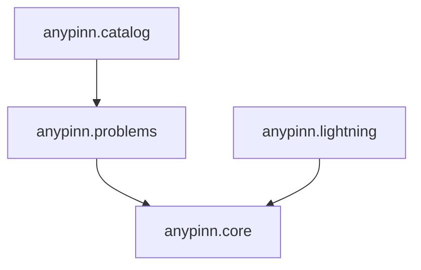

# Architecture

This page explains AnyPINN's design philosophy and how it compares to other
PINN libraries.

---

## Design principles

### Pure PyTorch

More than half of the existing PINN libraries are TensorFlow-based. PyTorch is
the de-facto standard for ML research, so AnyPINN builds on it exclusively.
All core primitives (`Field`, `Parameter`, `Problem`, `Constraint`) are
`nn.Module` subclasses, which means mixed precision, `torch.compile`, DDP, and
gradient checkpointing work without library-level support.

### Training is not the library's business

Every major competitor couples problem definition to its own training loop:

| Library | Coupling mechanism |
| ------- | ------------------ |
| NeuroDiffEq | `solve_ivp`-style API owns training |
| DeepXDE | `Model.train()` is not optional |
| IDRLNet | Computational graph node system owns training |
| NVIDIA Modulus | Full platform: owns Trainer, distributed, logging |
| PINA | Own `Trainer` wrapping Lightning |

AnyPINN's `Problem` is an `nn.Module`. Call `problem.training_loss(batch, log)`,
get a scalar tensor, call `.backward()`. PyTorch Lightning is available as an
optional layer for users who want batteries-included training, but it is never
required.

### Inverse problems first

Most PINN libraries target forward problems. AnyPINN treats inverse problems
as the primary use case:

- **`Parameter`** can be a learned scalar or a function-valued MLP. It shares
  the same `forward(x)` interface as a fixed `Argument`, so the ODE callable
  is agnostic to which parameters are learnable. Promoting a constant to a
  learnable parameter is a
  [one-line change](promote-constant-to-parameter.md).
- **`ValidationRegistry`** logs MSE between recovered and ground-truth
  parameters every training step. No other library in the comparison set offers
  this as a first-class feature.

---

## Layered architecture

| Layer | User | Purpose |
| ----- | ---- | ------- |
| `anypinn.catalog` | Experimenter | Pick a known problem, change config, run |
| `anypinn.problems` | Researcher | Define new physics, use provided constraints |
| `anypinn.core` | Framework builder | Own your training loop entirely |
| `anypinn.lightning` | Any level | Optional training integration |

Dependencies flow strictly inward (`catalog → problems → core`,
`lightning → core`). Each layer is usable without the ones above it.

---

## Developer experience

- **Typed frozen dataclasses** — `@dataclass(frozen=True, kw_only=True)` for
  all configuration. Typos are caught at construction time.
- **Static type checking** — `ty` in CI ensures type correctness.
- **Semantic versioning** — Conventional Commits drive automated releases.
- **Modern tooling** — `uv` + `hatchling` + Ruff.

---

## Bootstrap CLI

No library in the comparison set ships a scaffolding tool. `anypinn create`
generates a fully runnable project from 16 built-in templates. The researcher's
first action is editing `ode.py`, not reading API docs.

---

## Scope limitations

AnyPINN is strongest for **ODE inverse problems**: recovering parameters from
partial observations of dynamical systems. For complex 3D PDE simulations,
NVIDIA Modulus and DeepXDE remain more battle-tested.
